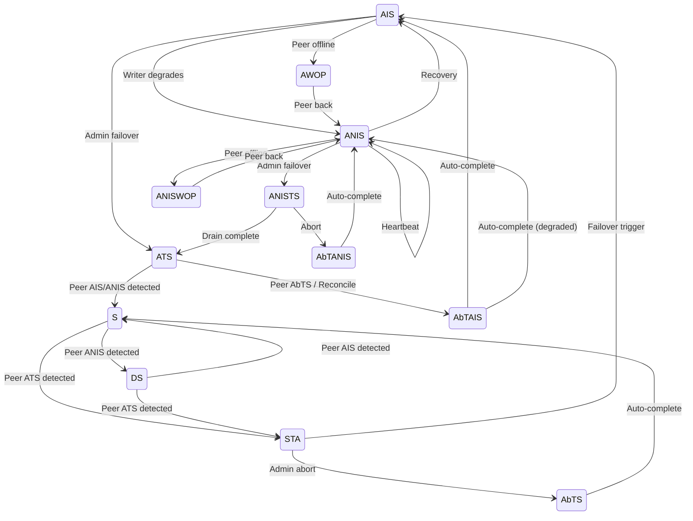

# Types -- Pure Definitions Module

**Source:** [`Types.tla`](../Types.tla)

## Overview

`Types` is a pure-definition module that provides all constants, type sets, state definitions, valid transition tables, role mappings, and helper operators used throughout the Phoenix Consistent Failover specification. It declares no variables; every definition is stateless. All sub-modules and the root orchestrator import these definitions via `EXTENDS Types`.

This module establishes the vocabulary of the specification: what states exist, which transitions between them are legal, how states map to the cluster roles visible to clients, and how the anti-flapping countdown timer operates. By centralizing these definitions, the specification ensures that every module shares a single source of truth for the protocol's state space.

### Why a Separate Module?

Factoring pure definitions into their own module is a TLA+ best practice for specifications of this size. It avoids duplication, makes the allowed-transition table auditable in isolation, and allows each sub-module to `EXTENDS Types` without pulling in variable declarations or action definitions from unrelated modules.

## Implementation Traceability

| Modeled Concept | Java Class / Field |
|---|---|
| `HAGroupState` (14 states) | `HAGroupStoreRecord.HAGroupState` enum (L51-65) |
| `AllowedTransitions` | `HAGroupStoreRecord` static initializer (L99-123) |
| `ClusterRole` (6 roles) | `ClusterRoleRecord.ClusterRole` enum (L59-107) |
| `RoleOf(state)` | `HAGroupState.getClusterRole()` (L73-97) |
| ANIS self-transition | `HAGroupStoreRecord` L101 (heartbeat support) |
| `WriterMode` (5 modes) | `ReplicationLogGroup` mode classes (SyncModeImpl, StoreAndForwardModeImpl, SyncAndForwardModeImpl) |
| `ReplayStateSet` (4 states) | `ReplicationLogDiscoveryReplay` replay state (L550-555) |

## Standard Module Extensions

```tla
EXTENDS Naturals, FiniteSets, TLC
```

The module extends `Naturals` (for arithmetic on timer values and replay counters), `FiniteSets` (for the `Cardinality` operator used in assumptions), and `TLC` (for model-checking support operators).

## Constants

The specification is parameterized over three constants that define the model's scope.

### Cluster

```tla
CONSTANTS Cluster

ASSUME Cluster # {}
ASSUME Cardinality(Cluster) = 2
```

`Cluster` is the finite set of cluster identifiers participating in the model. The Phoenix Consistent Failover protocol is designed for exactly two clusters forming an HA pair -- one active, one standby. The `Cardinality(Cluster) = 2` assumption encodes this architectural constraint. The model checker instantiates `Cluster` as `{c1, c2}` in all configurations.

### RS (Region Servers)

```tla
CONSTANTS RS

ASSUME RS # {}
```

`RS` is the finite set of region server identifiers per cluster. Each cluster runs the same set of RS; writer mode is tracked per `(cluster, RS)` pair. The exhaustive model uses 2 RS; the simulation model uses 9 RS to exercise production-scale per-RS writer interleaving. The set must be non-empty because the writer state machine is meaningless without at least one RS.

### WaitTimeForSync

```tla
CONSTANTS WaitTimeForSync

ASSUME WaitTimeForSync \in Nat
ASSUME WaitTimeForSync > 0
```

`WaitTimeForSync` is the anti-flapping wait threshold in logical time ticks. It controls how long the system must wait after the last STORE_AND_FWD heartbeat before the ANIS-to-AIS recovery transition is allowed. In the implementation, this maps to `HAGroupStoreClient.java` L98 where `ZK_SESSION_TIMEOUT_MULTIPLIER = 1.1` scales the ZK session timeout to produce the wait duration. The exhaustive model uses `WaitTimeForSync = 2` (the minimum value that exercises the timer's counting behavior); the simulation model uses `WaitTimeForSync = 5` to explore richer interleavings during the anti-flapping wait window.

## HA Group State Definitions

The HA group state is the central state variable of the protocol. Each cluster maintains its state as a ZooKeeper znode, updated via versioned `setData` (optimistic CAS locking).

### The 14 States

```tla
HAGroupState ==
    { "AIS", "ANIS", "ATS", "ANISTS",
      "AbTAIS", "AbTANIS", "AWOP", "ANISWOP",
      "S", "STA", "DS", "AbTS",
      "OFFLINE", "UNKNOWN" }
```

Each TLA+ abbreviation maps to a Java enum constant in `HAGroupStoreRecord.HAGroupState` (L51-65):

| TLA+ Value | Enum Constant | Meaning |
|---|---|---|
| `"AIS"` | `ACTIVE_IN_SYNC` | Active cluster, fully in sync with standby |
| `"ANIS"` | `ACTIVE_NOT_IN_SYNC` | Active cluster, at least one RS writing locally (HDFS degraded) |
| `"ATS"` | `ACTIVE_IN_SYNC_TO_STANDBY` | Transitioning from active to standby (mutations blocked) |
| `"ANISTS"` | `ACTIVE_NOT_IN_SYNC_TO_STANDBY` | ANIS failover path: draining OUT before advancing to ATS |
| `"AbTAIS"` | `ABORT_TO_ACTIVE_IN_SYNC` | Aborting failover, returning to AIS |
| `"AbTANIS"` | `ABORT_TO_ACTIVE_NOT_IN_SYNC` | Aborting failover, returning to ANIS |
| `"AWOP"` | `ACTIVE_WITH_OFFLINE_PEER` | Active with offline peer (not currently modeled in actions) |
| `"ANISWOP"` | `ACTIVE_NOT_IN_SYNC_WITH_OFFLINE_PEER` | ANIS with offline peer (not currently modeled in actions) |
| `"S"` | `STANDBY` | Standby cluster, receiving and replaying replication logs |
| `"STA"` | `STANDBY_TO_ACTIVE` | Transitioning from standby to active (failover in progress) |
| `"DS"` | `DEGRADED_STANDBY` | Standby with degraded active peer (peer in ANIS) |
| `"AbTS"` | `ABORT_TO_STANDBY` | Aborting failover, returning to standby |
| `"OFFLINE"` | `OFFLINE` | Cluster is offline |
| `"UNKNOWN"` | `UNKNOWN` | Unknown state |

The abbreviations are used throughout the specification for readability. `OFFLINE` and `UNKNOWN` are included for type completeness but are not reachable from the initial state in this model.

### State Classification Sets

The states are classified into sets based on their cluster role, which determines the client-visible behavior:

```tla
ActiveStates == { "AIS", "ANIS", "AbTAIS", "AbTANIS", "AWOP", "ANISWOP" }
```

A cluster in any `ActiveStates` member is considered active and serves mutations. The `MutualExclusion` invariant requires that at most one cluster be in an `ActiveStates` member at any time. Source: `HAGroupState.getClusterRole()` L73-97 -- these states return `ClusterRole.ACTIVE`.

```tla
StandbyStates == { "S", "DS", "AbTS" }
```

A cluster in any `StandbyStates` member is receiving and replaying replication logs from the active peer. Source: `HAGroupState.getClusterRole()` L73-97 -- these states return `ClusterRole.STANDBY`.

```tla
TransitionalActiveStates == { "ATS", "ANISTS" }
```

A cluster in `ATS` or `ANISTS` is transitioning from active to standby during a failover. Critically, mutations are blocked (`isMutationBlocked() = true`). This is the mechanism by which safety is maintained during the non-atomic failover window: the old active is in `ACTIVE_TO_STANDBY` role, which blocks all client mutations, even though the new active has already written `ACTIVE_IN_SYNC`. Source: `ClusterRoleRecord.java` L84 -- `ACTIVE_TO_STANDBY` role has `isMutationBlocked() = true`.

```tla
ActiveRoles == {"ACTIVE"}
```

`ActiveRoles` operates at the role abstraction layer (not the state layer). It is the set of roles considered "active" for role-level predicates such as `MutualExclusion`. Distinguished from `ActiveStates` (which is the set of HA group *states* that map to the ACTIVE role): `ActiveRoles` is used in predicates that compare role values, not state values. Source: `ClusterRoleRecord.java` L59-67 -- the ACTIVE role has `isMutationBlocked() = false`.

## Replication Writer Mode Definitions

```tla
WriterMode == {"INIT", "SYNC", "STORE_AND_FWD", "SYNC_AND_FWD", "DEAD"}
```

Each RegionServer on the active cluster maintains one of five writer modes. The mode determines how mutations are replicated:

| TLA+ Value | Java Class | Behavior |
|---|---|---|
| `"INIT"` | Pre-initialization | RS has not yet started writing; transitional state during startup |
| `"SYNC"` | `SyncModeImpl` | Writing directly to standby HDFS; normal steady-state mode |
| `"STORE_AND_FWD"` | `StoreAndForwardModeImpl` | Writing locally to the OUT directory when standby HDFS is unavailable |
| `"SYNC_AND_FWD"` | `SyncAndForwardModeImpl` | Draining the local OUT queue while also writing synchronously; recovery/drain mode |
| `"DEAD"` | RS aborted | Writer halted due to CAS failure or local HDFS failure; awaiting process supervisor restart |

The `DEAD` mode is a modeling addition -- the implementation does not have an explicit "DEAD" mode enum. Instead, when `logGroup.abort()` is called (via `RuntimeException` from a CAS failure in `SyncModeImpl.onFailure()` L61-74), the Disruptor halts and the RS process is effectively dead. The process supervisor (Kubernetes/YARN) detects the dead pod and restarts it.

Source: `ReplicationLogGroup.java` mode classes; `SyncModeImpl.onFailure()` L61-74 (CAS failure leads to abort).

## Replication Replay State Definitions

```tla
ReplayStateSet == {"NOT_INITIALIZED", "SYNC", "DEGRADED", "SYNCED_RECOVERY"}
```

The standby cluster's reader maintains one of four replay states per HA group, tracking the consistency of the replay relative to the active cluster's replication stream:

| TLA+ Value | Meaning |
|---|---|
| `"NOT_INITIALIZED"` | Pre-init; reader has not started. Used on the active side where the reader is dormant. |
| `"SYNC"` | Fully in sync; `lastRoundProcessed` and `lastRoundInSync` advance together. Every round processed represents a consistent state. |
| `"DEGRADED"` | Active peer is in ANIS (degraded replication); `lastRoundProcessed` advances but `lastRoundInSync` is frozen. Rounds processed during DEGRADED may contain incomplete data. |
| `"SYNCED_RECOVERY"` | Active peer returned to AIS; replay rewinds `lastRoundProcessed` to `lastRoundInSync` before resuming in SYNC mode. This ensures all rounds from the degraded period are re-processed from the last known consistent point. |

The replay state machine is the key mechanism for achieving zero RPO. The `TriggerFailover` action (in [Reader.md](Reader.md)) requires `replayState = "SYNC"` -- failover cannot proceed until the SYNCED_RECOVERY rewind completes and the replay catches up from the last in-sync point.

Source: `ReplicationLogDiscoveryReplay.java` L550-555.

## Allowed Transitions

The `AllowedTransitions` set defines every valid `(from, to)` state transition pair. This is derived directly from the `allowedTransitions` static initializer in `HAGroupStoreRecord.java` (L99-123) and serves as the ground truth for the `TransitionValid` action constraint. TLC verifies that every state change produced by the `Next` relation is a member of this set.

```tla
AllowedTransitions ==
    {
      <<"ANIS", "ANIS">>,
      <<"ANIS", "AIS">>,
      <<"ANIS", "ANISTS">>,
      <<"ANIS", "ANISWOP">>,
      <<"AIS", "ANIS">>,
      <<"AIS", "AWOP">>,
      <<"AIS", "ATS">>,
      <<"S", "STA">>,
      <<"S", "DS">>,
      <<"ANISTS", "AbTANIS">>,
      <<"ANISTS", "ATS">>,
      <<"ATS", "AbTAIS">>,
      <<"ATS", "S">>,
      <<"STA", "AbTS">>,
      <<"STA", "AIS">>,
      <<"DS", "S">>,
      <<"DS", "STA">>,
      <<"AWOP", "ANIS">>,
      <<"AbTAIS", "AIS">>,
      <<"AbTAIS", "ANIS">>,
      <<"AbTANIS", "ANIS">>,
      <<"AbTS", "S">>,
      <<"ANISWOP", "ANIS">>
    }
```

### Notable Entries

**ANIS self-transition** (`<<"ANIS", "ANIS">>`): This entry supports the periodic heartbeat in `StoreAndForwardModeImpl` (L71-87) that refreshes the ZK znode's `mtime` without changing the state value. In the TLA+ model, this maps to the `ANISHeartbeat` action in [HAGroupStore.md](HAGroupStore.md), which resets the anti-flapping countdown timer to `StartAntiFlapWait`. Source: `HAGroupStoreRecord.java` L101.

**DS -> STA** (`<<"DS", "STA">>`): This entry supports the ANIS failover path where the standby is in `DEGRADED_STANDBY` when failover proceeds. The admin initiates failover on the active (ANIS -> ANISTS), the forwarder drains OUT (ANISTS -> ATS), and the standby detects ATS and transitions DS -> STA. Source: L117.

**AbTAIS -> ANIS** (`<<"AbTAIS", "ANIS">>`): This entry is needed so that HDFS failure during the abort window can route the cluster to ANIS. Without it, S&F writers that degrade during AbTAIS would have no path to a consistent state -- the cluster would be stuck in AbTAIS with degraded writers and no way for `AutoComplete` to route to ANIS.

### Transition Diagram



## Cluster Role Definitions

```tla
ClusterRole ==
    { "ACTIVE", "ACTIVE_TO_STANDBY", "STANDBY",
      "STANDBY_TO_ACTIVE", "OFFLINE", "UNKNOWN" }
```

The six cluster roles are visible to clients and determine whether a cluster accepts mutations. Source: `ClusterRoleRecord.ClusterRole` enum (L59-107).

### RoleOf Mapping

```tla
RoleOf(state) ==
    IF state \in ActiveStates THEN "ACTIVE"
    ELSE IF state \in TransitionalActiveStates THEN "ACTIVE_TO_STANDBY"
    ELSE IF state \in StandbyStates THEN "STANDBY"
    ELSE IF state = "STA" THEN "STANDBY_TO_ACTIVE"
    ELSE IF state = "OFFLINE" THEN "OFFLINE"
    ELSE "UNKNOWN"
```

`RoleOf` maps each HA group state to its client-visible cluster role. This operator is used in the `MutualExclusion` invariant to verify that at most one cluster is in the `ACTIVE` role at any time. The mapping is derived from `HAGroupState.getClusterRole()` L73-97 in the Java implementation.

The critical safety insight is that `ATS` and `ANISTS` map to `ACTIVE_TO_STANDBY` (not `ACTIVE`), which means mutations are blocked during the failover window. This is how the protocol maintains mutual exclusion even though the failover is non-atomic (two independent ZK writes).

## Helpers

### Peer

```tla
Peer(c) == CHOOSE p \in Cluster : p # c
```

Returns the other cluster in the 2-cluster model. Since `|Cluster| = 2`, there is exactly one cluster that is not `c`. The `CHOOSE` operator deterministically selects it. This helper is used pervasively throughout the specification to reference the peer cluster's state.

## Anti-Flapping Countdown Timer Helpers

The anti-flapping mechanism uses a per-cluster countdown timer following the pattern from Lamport, "Real Time is Really Simple" (CHARME 2005, Section 2). The key idea is that real-time constraints can be modeled as ordinary state variables without introducing a separate notion of time.

Each cluster's timer counts **down** from `WaitTimeForSync` toward 0. The timer does not represent a clock running backwards -- it represents a waiting period expiring:

```
WaitTimeForSync ... 2 ... 1 ... 0
|---- gate closed (waiting) ----|  gate open (transition allowed)
```

The S&F heartbeat (`ANISHeartbeat` in [HAGroupStore.md](HAGroupStore.md)) resets the timer to `WaitTimeForSync`, keeping the gate closed. When the heartbeat stops (all RS exit STORE_AND_FWD), the `Tick` action (in [Clock.md](Clock.md)) counts the timer down to 0, opening the gate and allowing ANIS -> AIS.

Source: `HAGroupStoreClient.validateTransitionAndGetWaitTime()` L1027-1046; `StoreAndForwardModeImpl.startHAGroupStoreUpdateTask()` L71-87.

### Modeling Choice: Countdown vs. Deadline

The Lamport countdown pattern was chosen over a deadline-based approach (tracking a target time and comparing against a global clock) because:

1. **No global clock needed.** The countdown timer is a local variable per cluster, avoiding the need for a shared time variable and the complexity of relating local and global time.
2. **Minimal state space.** The timer ranges over `0..WaitTimeForSync`, a small finite set. A global clock would grow unboundedly.
3. **Natural guard encoding.** The enabling condition for the guarded transition is simply `timer = 0`, which is a single equality check.

### Helper Operators

```tla
AntiFlapGateOpen(t) == t = 0
```

TRUE when the anti-flapping wait period has fully elapsed. The guarded transition (ANIS -> AIS or ANISTS -> ATS) may proceed.

```tla
AntiFlapGateClosed(t) == t > 0
```

TRUE when the anti-flapping wait is still in progress. The guarded transition is blocked.

```tla
DecrementTimer(t) == IF t > 0 THEN t - 1 ELSE 0
```

Advances the countdown timer one tick toward 0, with a floor at 0. Used by the `Tick` action to model the passage of time.

```tla
StartAntiFlapWait == WaitTimeForSync
```

The value that starts (or restarts) the anti-flapping wait. Used when a cluster enters ANIS or when the S&F heartbeat fires.
